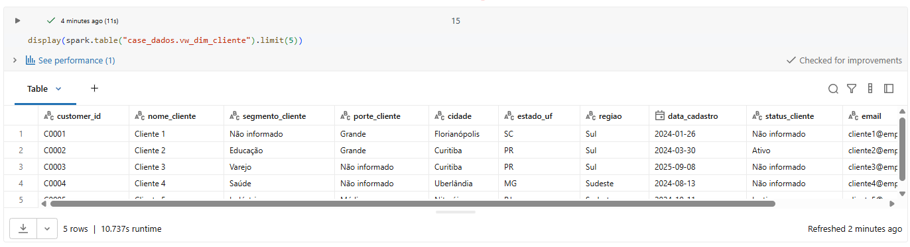
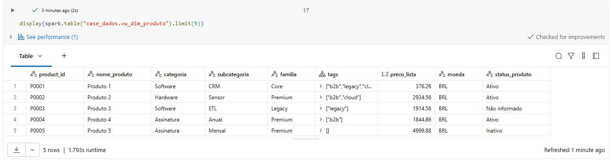
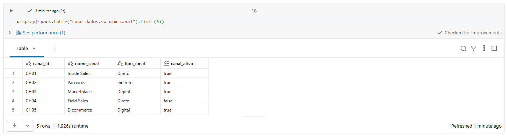
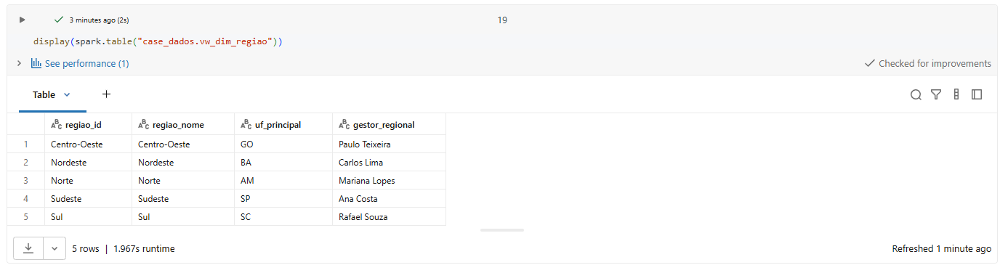
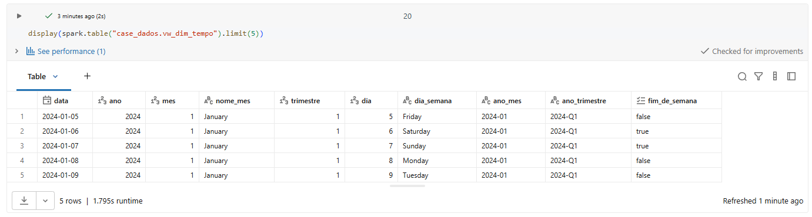
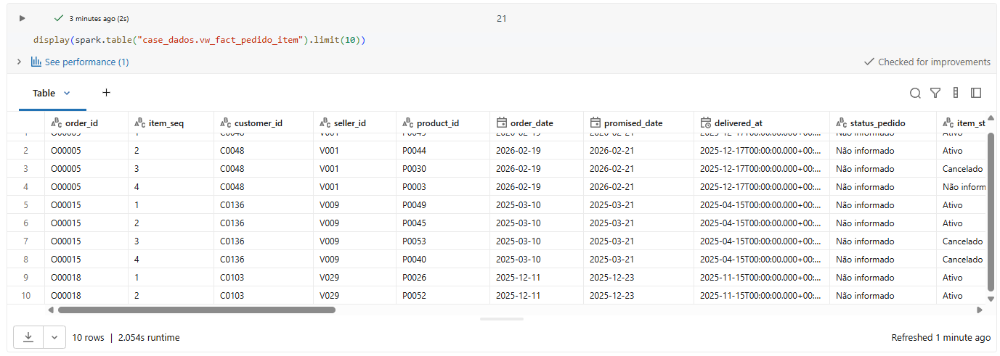
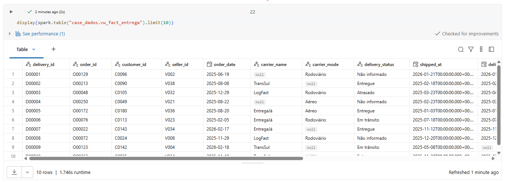
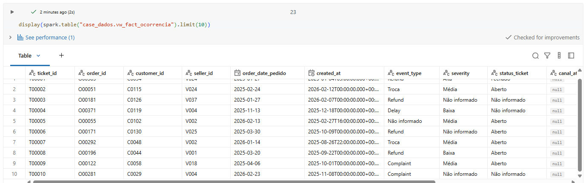

# Case Engenheiro de Dados

Pipeline de engenharia de dados em camadas (Bronze → Silver → Gold), construída em Databricks com PySpark e Delta Lake, transformando 9 fontes brutas e heterogêneas numa base analítica pronta para consumo por um Analista de BI.


## Como executar

1. Criar um schema e um volume no Unity Catalog (Databricks Free Edition). Isso é feito automaticamente pelo notebook `notebooks/00_setup/00_setup_ambiente.ipynb`.
2. Subir os 9 arquivos fonte para o volume (`Catalog > workspace > case_dados > Volumes > raw_files > Upload to this volume`).
3. Importar a pasta `notebooks/` para o Workspace do Databricks, mantendo a mesma estrutura de subpastas.
4. Abrir `notebooks/00_run_tudo.ipynb` (precisa estar no mesmo nível das 4 subpastas) e rodar. Ele instala a dependência de leitura de Excel e executa os 14 notebooks na ordem correta, incluindo a criação das views finais.

Os notebooks também podem ser executados manualmente, um a um, na ordem numérica das pastas.

## Exemplo de saída

Resultado real das 9 views criadas pelo notebook `notebooks/03_gold/14_gold_views.ipynb`, após a execução completa da pipeline.

### Dimensões

**vw_dim_cliente**



**vw_dim_vendedor**


**vw_dim_produto**



**vw_dim_canal**



**vw_dim_regiao**



**vw_dim_tempo**



### Fatos

**vw_fact_pedido_item**



**vw_fact_entrega**



**vw_fact_ocorrencia**



## Documentação

| Arquivo | Conteúdo |
|---|---|
| [`docs/ambiente.md`](docs/ambiente.md) | Databricks Free Edition e suas particularidades |
| [`docs/bronze.md`](docs/bronze.md) | As 9 fontes e o que cada uma tinha de errado |
| [`docs/silver.md`](docs/silver.md) | Limpeza, normalização e regras de deduplicação |
| [`docs/gold.md`](docs/gold.md) | Modelo dimensional final (dimensões e fatos) |
| [`docs/problemas-execucao.md`](docs/problemas-execucao.md) | Bugs que só apareceram rodando no Databricks |
| [`docs/validacoes-e-limitacoes.md`](docs/validacoes-e-limitacoes.md) | Validações aplicadas, limitações e próximos passos |
| [`docs/resumo-executivo.md`](docs/resumo-executivo.md) | Versão condensada de tudo acima ([.pptx](docs/resumo-executivo.pptx)) |

## Notebooks

```
notebooks/
├── 00_run_tudo.ipynb      orquestrador, roda tudo em sequência
├── 00_setup/              cria schema, volume e valida upload
├── 01_bronze/             ingestão crua das 9 fontes
├── 02_silver/             limpeza e normalização, um notebook por fonte
└── 03_gold/               modelo dimensional final, exemplos de KPI e views
```
