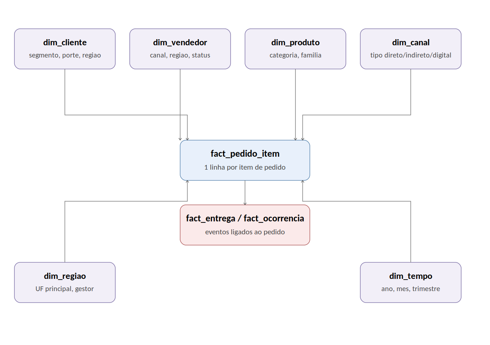

# Gold — modelo dimensional final

A camada Gold entrega o modelo analítico final: 6 dimensões e 3 fatos, prontos para consumo direto por uma ferramenta de BI.

## Granularidade da fato principal

`fact_pedido_item` possui granularidade de item de pedido (`order_id` + `item_seq`), não de pedido. A granularidade mais fina permite agregação para o nível de pedido (`GROUP BY order_id`) e segmentação por produto/categoria, requisito explícito do negócio — a operação inversa, decompor pedido em item, não seria possível a partir de uma fato agregada.

## Rateio de receita por item

`net_amount` está disponível apenas no cabeçalho do pedido. Para evitar duplicação de receita ao agregar por item, a receita líquida é rateada proporcionalmente ao peso de cada item no total do pedido (`total_item` do item dividido pela soma de `total_item` do pedido). A soma de `receita_liquida_item` por pedido reconcilia integralmente com `net_amount` do cabeçalho — validação aplicada no próprio notebook.

## Fatos de evento separados

`fact_entrega` e `fact_ocorrencia` são mantidas como fatos independentes, com granularidade própria (uma linha por entrega, uma linha por ticket), pois um pedido pode estar associado a mais de uma entrega ou ocorrência. A combinação dessas fatos com `fact_pedido_item` em uma única tabela duplicaria linhas. O relacionamento entre as três fatos é feito por `order_id`.

## Dimensões

| Tabela | Conteúdo |
|---|---|
| `dim_cliente` | Segmento, porte, cidade, UF, região, status, e-mail (com flag de validade) |
| `dim_vendedor` | Canal de venda, tipo de canal, região, status |
| `dim_produto` | Categoria, subcategoria, família, tags, preço de lista, status |
| `dim_canal` | Tipo (direto/indireto/digital), status ativo |
| `dim_regiao` | UF principal, gestor regional |
| `dim_tempo` | Calendário diário gerado, com ano, mês, trimestre, dia da semana, fim de semana |

## Fatos

| Tabela | Granularidade | Conteúdo |
|---|---|---|
| `fact_pedido_item` | Item de pedido | Região, canal/tipo de canal, flags de cancelamento/atraso, lead time, custo de frete, flag de inconsistência |
| `fact_entrega` | Entrega | Cliente, vendedor e data do pedido associado, tempo de trânsito, custo |
| `fact_ocorrencia` | Ticket de atendimento | Cliente, vendedor e status do pedido associado, SLA, canal de atendimento |

Exemplos de queries que esse modelo responde direto, sem join adicional, estão no notebook `notebooks/03_gold/13_gold_exemplos_kpis.ipynb`: receita líquida por região/mês, taxa de cancelamento por canal, taxa de atraso por região de destino, receita por categoria, volume de ocorrências por tipo/severidade, evolução trimestral.
